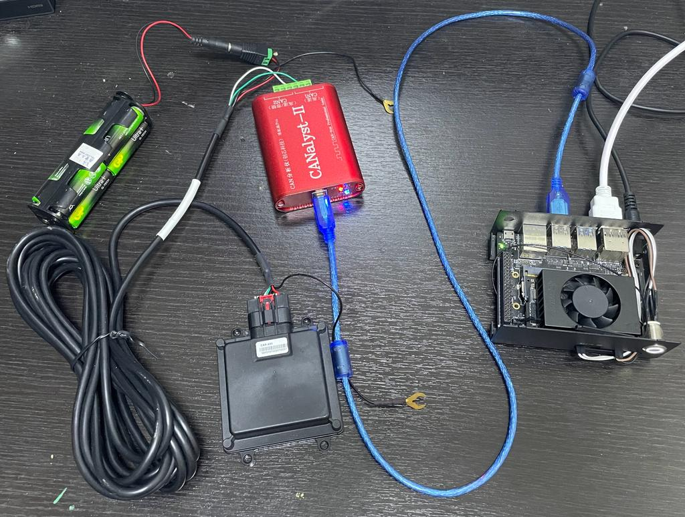
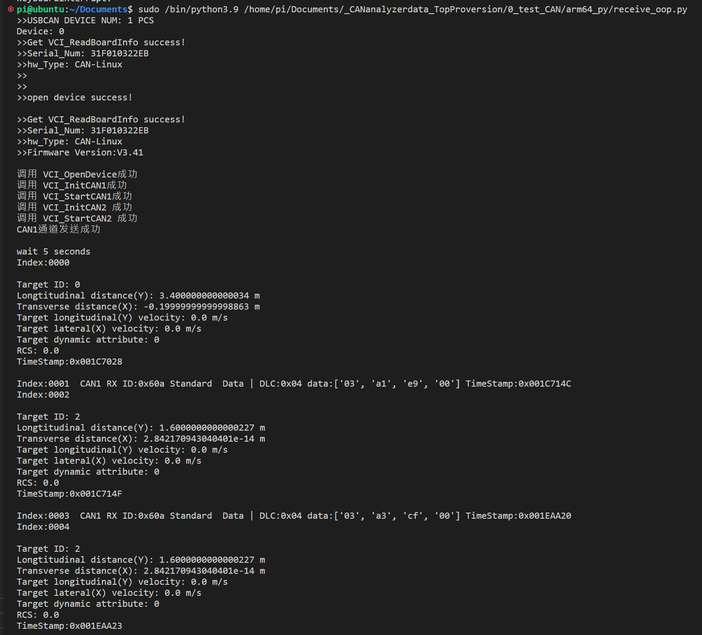

# CAR-A60_radar_sensor_jetson
#jetson

## Features of receive.py
If the CAN analyzer reads data with a self.rxid value equal to 0x60b, the program will decode the data into a more understandable format and print out information about it.
```python
                    if self.rxid == 0x60b:
                        self.convert_60b(int_arr, rec[j])
                    else:
                        print(f"CAN{ind+1} RX ID:{hex(self.rxid)}", end="")
                        if rec[j].ExternFlag == 0:
                            print(" Standard ", end="")
                        if rec[j].ExternFlag == 1:
                            print(" Extend   ", end="")
                        if rec[j].RemoteFlag == 0:
                            print(" Data | ", end="")
                        if rec[j].RemoteFlag == 1:
                            print(" Remote | ", end="")
                        print(f"DLC:0x{rec[j].DataLen:02X}", end="")
                        print(" data:", end="")
                        hex_int_arr = ["{:02x}".format(num) for num in int_arr]
                        print(hex_int_arr, end="")
                        print(f" TimeStamp:0x{rec[j].TimeStamp:08X}")
```

## Hardware connection example



## How to start
After connecting all the hardware, run the following command in the terminal.
```shell
cd ~/Documents
git clone https://github.com/OneLif2/CAR-A60_radar_sensor_jetson.git
cd CAR-A60_radar_sensor_jetson/arm64_py/
sudo python3 receive.py
```
*remark: In order to operate USB devices, the program must be executed with root privileges. This is because the program accesses low-level USB drivers in the Linux system. To ensure that the program has the necessary permissions, use the ‘sudo’ command when running it. *

*As an alternative, you can refer to the ‘USB权限设置.pdf’ document under the reference folder for instructions on how to configure your Jetson. By following these steps, you’ll be able to run the program without the need for ‘sudo’ privileges.*

## Program(receive.py) output


## For program in controlcan folder. Remove and make hello_cpp again.
```shell
cd controlcan
rm hello_cpp
make clean && make
sudo ./hello_cpp
```


## To do in future
1.) Adding featues to calculate the target radial distance:
R=sqrt(Objects_DistLong*Objects_DistLong+Objects_Distlat*Objects_Distlat)

2.) Adding featues to calculate the target Angle is:
Tanθ = Objects_Distlat / Objects_DisLong