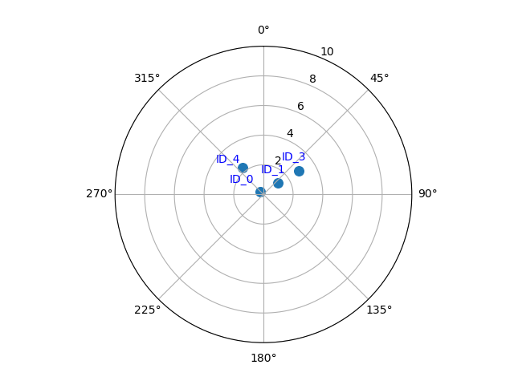

# CAR-A60_radar_sensor_jetson
#jetson

## Features of receive.py
If the CAN analyzer reads data with a self.rxid value equal to 0x60b, the program will decode the data into a more understandable format and print out information about it.
```python
                    if self.rxid == 0x60b:
                        self.convert_60b(int_arr, rec[j])
                    else:
                        print(f"CAN{ind+1} RX ID:{hex(self.rxid)}", end="")
                        if rec[j].ExternFlag == 0:
                            print(" Standard ", end="")
                        if rec[j].ExternFlag == 1:
                            print(" Extend   ", end="")
                        if rec[j].RemoteFlag == 0:
                            print(" Data | ", end="")
                        if rec[j].RemoteFlag == 1:
                            print(" Remote | ", end="")
                        print(f"DLC:0x{rec[j].DataLen:02X}", end="")
                        print(" data:", end="")
                        hex_int_arr = ["{:02x}".format(num) for num in int_arr]
                        print(hex_int_arr, end="")
                        print(f" TimeStamp:0x{rec[j].TimeStamp:08X}")
```

## Hardware connection example


## How to start
After connecting all the hardware, run the following command in the terminal.
```shell
cd ~/Documents
git clone https://github.com/OneLif2/CAR-A60_radar_sensor_jetson.git
cd CAR-A60_radar_sensor_jetson/arm64_py/
sudo python3 receive.py
```
*remark: In order to operate USB devices, the program must be executed with root privileges. This is because the program accesses low-level USB drivers in the Linux system. To ensure that the program has the necessary permissions, use the ‘sudo’ command when running it.*

*As an alternative, you can refer to the ‘USB权限设置.pdf’ document under the reference folder for instructions on how to configure your Jetson. By following these steps, you’ll be able to run the program without the need for ‘sudo’ privileges.*

## Program(receive.py) output


## For program in controlcan folder. Remove and make hello_cpp again.
```shell
cd controlcan
rm hello_cpp
make clean && make
sudo ./hello_cpp
```


## New key features for receive_animation.py

This radar sensor visualization tool is designed to offer real-time tracking and analysis of objects detected by a radar sensor. Here's what makes it stand out:

- **Dynamic Calculations and Metrics:** The tool processes raw sensor data to calculate and display the radial distance, angle, and relative velocity of each detected target. These metrics are crucial for understanding the spatial dynamics and movement patterns of the targets relative to the radar's position.

- **Real-Time Plotting on Polar Coordinates:** Utilizing a polar coordinate system, the tool plots the position of each target, updating the visualization dynamically as new data comes in. This feature provides a clear and intuitive visual representation of the target's location and movement over time.

- **Intelligent Target Identification:** Each target is annotated with a unique ID on the plot. These annotations are linked directly to their respective targets, ensuring they move in sync with the targets and enhancing the ease of tracking multiple targets simultaneously.

- **Automated Cleanup with Timeout Mechanism:** To maintain the relevance and accuracy of the display, the tool automatically removes targets and their annotations if they haven't been updated within a specific timeframe (1 second). This mechanism keeps the visualization current, removing stale or out-of-range targets.

- **Performance Optimization for Live Updates:** The tool is optimized to handle live data updates and refresh the visualization smoothly and efficiently. This ensures a seamless user experience, even with rapid movements or the appearance of new targets.

- **Thread-Safe Operations:** Designed with concurrency in mind, the tool ensures thread-safe operations for data handling and visualization updates, making it robust and reliable for real-time applications.


## Program(receive_animation.py) output


## Program(receive_animation.py) output in terminal
```shell
Index:12945  

Target ID: 1
Target Radial Distance: 0.4000000000000341 m
Target Angle: 4.071109992272954e-12 degrees
Target Velocity: 0.0 m/s
Target dynamic attribute: 0
RCS: 0.0
TimeStamp:0x00235979 

Index:12946  

Target ID: 3
Target Radial Distance: 1.1313708498984922 m
Target Angle: 45.0 degrees
Target Velocity: 0.0 m/s
Target dynamic attribute: 0
RCS: 0.0
TimeStamp:0x0023597C 

Index:12947  

Target ID: 0
Target Radial Distance: 2.332380757938114 m
Target Angle: -30.96375653207328 degrees
Target Velocity: 0.0 m/s
Target dynamic attribute: 0
RCS: 0.0
TimeStamp:0x0023597E
```